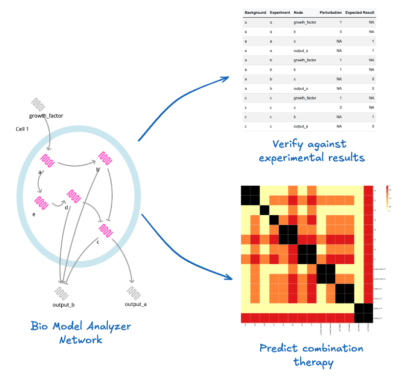

# NANSEN: (Network Analysis aNd ScrEeNing)
Repository for NANSEN, a package for verification and analysis of biological network models built with [Bio Model Analyzer](http://biomodelanalyzer.org/).

_[Matthew A. Clarke](https://mclarke1991.github.io/), [Pedro Victori](https://www.linkedin.com/in/pedro-victori/), [Jasmin Fisher](https://www.ucl.ac.uk/medical-sciences/divisions/cancer/our-research/computational-cancer-biology)._



To use, please install Bio Model Analyzer command line tools from [here](http://biomodelanalyzer.org/#:~:text=View%20Source-,Get%20Standalone,-Alumni), the package will automatically point to the default path for this installation on Windows. 

Use on UNIX systems is experimental, and requires installing the full command-line tools from [here](https://github.com/hallba/BioModelAnalyzer/issues/68). 

Then install NANSEN from GitHub:

```r
remotes::install_github("jfisher-lab/nansen")
```

NANSEN uses the [here](https://here.r-lib.org/) to enable easy file referencing, and so works best in a [git](https://git-scm.com/) repository. 

## Key Features

NANSEN ("Network Analysis aNd ScrEeNing") is an open–source R package that wraps the **[Bio Model Analyzer (BMA)](http://biomodelanalyzer.org/)** command-line tools in a tidy, reproducible workflow for verifying, perturbing and systematically screening discrete gene-regulatory network models.

The package allows modellers and experimentalists to:

* **Validate network specifications** – automatically check that experimental perturbation spreadsheets are consistent with the logical model and flag common errors before running long simulations.
* **Run large perturbation screens** – generate, execute and parse thousands of BMA jobs that test every gene perturbation ("autopert") or pair-wise gene/drug combination ("combo").
* **Perform high–throughput drug & mutation searches** – quantify phenotypic effects of single or double perturbations, optionally against user-defined genetic backgrounds.
* **Visualise results** – produce publication-ready heat-maps that highlight the most influential nodes, druggable targets or synthetic-lethal pairs.

## Key functionality

| Category | Function(s) | Purpose |
| -------- | ----------- | ------- |
| Specification testing | `autopert()` | Runs a full single-node perturbation screen using a network `.json` file and a specification `.csv`.  Automatically writes BMA commands, executes them and parses JSON output back into tidy data frames. |
| Combination testing | `combo()` + helpers (`make_bkg_commands_combo()`, `make_pair_drugs()`, …) | Screens all pairwise perturbations (node×node, druggable×druggable or drug×drug) across multiple genetic backgrounds. |
Configuration runners | run_autopert_config.r, run_combo_config.r | One-liner wrappers that read a TOML file and execute an entire workflow.
| Data import | `import_spec()`, `import_drugs_clean()`, `get_netw_variables()` | Read and sanitise network variables, perturbation sheets and drug mapping files. |
| Quality control | `check_spec_groups()`, `check_perts_in_range()`, `stop_missing_*()` | Early-exit guards that stop a run when inputs are malformed or biologically impossible. |
| Visualisation | `plot_*`, `heatmaps.R` | Utility functions for clustered/un-clustered heat-maps and difference plots (single vs double perturbations). |
Biocheck log parsing | parse_biocheck_json(), parse_biocheck_dir(), parse_biocheck_dir_apend() | Turn raw BMA biocheck logs into tidy tibbles.
Configuration validators | validate_autopert_config(), validate_combo_config() | Fail if a TOML file is malformed or paths are missing before any simulation starts.
Result post-processing | process_results() | Summarises combo screens, computes metrics and ranks perturbations.


Most functions follow tidyverse conventions and return `tibble` objects for easy downstream manipulation.

### 1. Automated model verification – `autopert()`

`autopert()` compares model behaviour against an experimental specification that lists node perturbations and the expected outcomes.
It automatically:

* validates the specification (`check_spec_groups()`, `check_perts_in_range()` …)
* executes BioModelAnalyzer in *VMCAI* (no-SAT) mode for every experimental condition
* aggregates results and scores the mismatch to highlight potential issues with the model

Minimal example

```r
library(NANSEN)

autopert(
  netw_file_path = "examples/autopert/helper_autopert_1.json",
  spec_path      = "examples/autopert/helper_spec_1.csv",
  out_dir        = "examples/autopert/results"
)
```

Command line usage:

```bash
Rscript examples/run_autopert_config.r examples/autopert_config_example.toml 
```

For details of how to write specification files, see [examples/README.md](examples/README.md). 

### 2. Combination perturbation screening – `combo()` & helpers in `combo_funcs.r`

The functions defined in `R/combo_funcs.r` allow exhaustive screening of single and pairwise perturbations—including drug-like interventions—across multiple genetic backgrounds.

Key helpers include:

* `make_bkg_commands_combo()` – build background-specific BMA command strings
* `make_single_muts()` / `make_pair_muts()` – generate all single/double node perturbations
* `import_drugs_clean()`, `get_drugs_commands()` – integrate pharmacological perturbations

`combo()` orchestrates the workflow, runs BMA for every background/perturbation combination and outputs tidy result tables (`parsed_results.csv`, `processed_results.csv`) that can be mined for synergistic pairs or synthetic lethal interactions.

```r
combo(
  netw_file_path    = "examples/combo/helper_combo_1.json",
  backgrounds_path  = "examples/combo/helper_combo_bkg_1.csv",
  drug_path         = "examples/combo/helper_combo_drugs_1.csv",
  out_dir           = "examples/combo/results",
  log_filename      = "combo.log"
)
```

Command line usage:

```bash
Rscript examples/run_combo_config.r examples/combo_config_example.toml
```

For details of how to write specification files, see [examples/README.md](examples/README.md). 

## Citation 

If you use NANSEN in your research, please cite:

```bibtex
@software{nansen2025,
  author = {Matthew A. Clarke, Pedro Victori, Jasmin Fisher},
  title = {NANSEN: Network Analysis of regulatoN-baSed gEnE Networks},
  year = {2025},
  url = {https://github.com/jfisher-lab/nansen},
  version = {1.0.0},
  note = {A R package for verification and analysis of biological gene regulatory network models built with Bio Model Analyzer}.
}
```